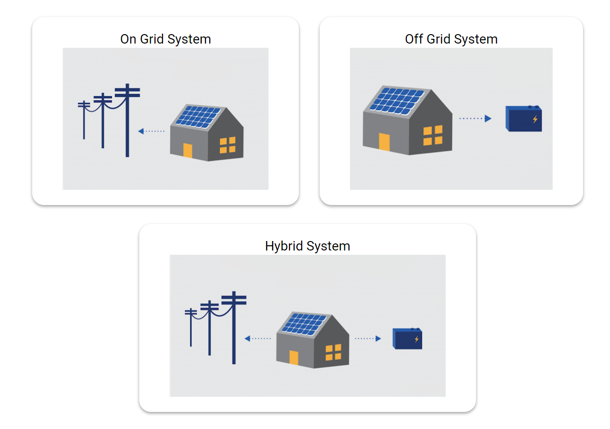

# Photovoltaic System Designer

Photovoltaic System Designer is an easy to use calculator that uses the standard formulas to calculate and output the parameters for PV System.

## Installation

 1. ### Full Download
	- [Download](https://github.com/just-a-rookie-2001/Photovoltaic-System-Designer/archive/master.zip) the repository in .zip format

		OR

	 - Clone the repository using Git
	`git clone https://github.com/just-a-rookie-2001/Photovoltaic-System-Designer.git`

2. ### Part Download
	- To download certain part(s) of the repository download the required *.html* file, *css/main.css*, *css/reset.css* and the corresponding *.js* file from js/
		- For example, if **Offgrid System** is required download offgrid.html, main.css, reset.css, offgrid.js
		- **Note**: Make sure to preserve the folder structure i.e. .css files in *css* folder, .js files in *js* folder

## Deploy on LocalHost

Note: The project uses FETCH API, thus without a server the data will not load into the memory.

 1. ### Using Visual Studio Code and 'Live Server' extension
	 - Download Live Server extension from [Visual Studio Marketplace](https://marketplace.visualstudio.com/items?itemName=ritwickdey.LiveServer&ssr=false#overview) 
	 - Open the repository foler in VSCode and click on "Go Live" button (bottom right) in the status bar

 2. ### Using Python HTTP server
	 - Navigate to the repository directory using Terminal
	 - Type `python -m http.server` in the terminal to start the sever
	 - In your browser enter the url http://localhost:8000 or http://127.0.0.1:8000

## Navigation
**VERY IMPORTANT**: Make sure to click on 'Next' button everytime the parameters are modified to save the data. If the 'next' button is not clicked everytime, then the output will be null.

## Modifying Solar Irradiation Data

The solar irradiation data is hard coded into *data.json*. Data is collected from [this](http://www.synergyenviron.com/tools/solar-irradiance) site (currently the data of only **Indian States and Cities** is hard coded). If the data needs to be modified, json structure shall not be changed.

    {
	        state_name: {
					    city_name: data,
					    city_name: data,
					    ...
					    city_name: data
		},
	        state_name: {
					    city_name: data,
					    city_name: data,
					    ...
					    city_name: data
		},
		...
		state_name: {
					    city_name: data,
					    city_name: data,
					    ...
					    city_name: data
		}    
    }
